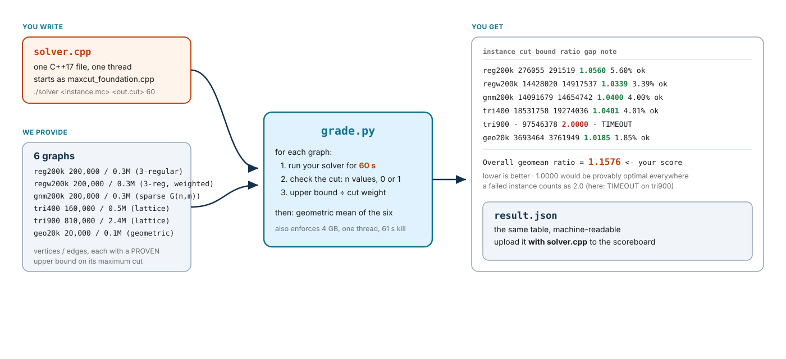

# Max-Cut — Approximation Competition

You are given a working approximation algorithm for Max-Cut,
`maxcut_foundation.cpp`: the randomized 1/2-approximation from the lecture
(put every vertex on a random side; each edge is cut with probability 1/2)
followed by the obvious local improvement (move any vertex that has more
weight on its own side than across). Copy it to `solver.cpp` and make its
cuts **heavier**. Same input, a valid cut out, 60 seconds, one thread.

This is not a speed contest. Every solver gets the same 60 s per instance.
What is measured is **how close your cut is to the optimum**: a proven upper
bound on the maximum cut divided by the weight of your cut. 1.000 would be
optimal. The foundation scores about 1.12.

**Your entire job is one C++ file.** Everything else — running, timing,
checking, scoring — is done by one Python script, `grade.py`. You hand in
`solver.cpp` and the `result.json` it writes by uploading them to the
scoreboard at **https://maxcut.ccu2026algorithm.workers.dev**
(see [What to submit](#what-to-submit)).

## How the pieces fit



You only touch `solver.cpp`. One command produces the table on the right, and
the `Overall geomean ratio` line is your score. **Lower is better.**

## Quick start

```sh
make foundation                          # 1. build the baseline
scripts/download.sh                      # 2. fetch the six scored graphs (25 MB, once)
cp maxcut_foundation.cpp solver.cpp      # 3. this file is your assignment
make solver                              #    ...edit solver.cpp, rebuild...
python3 grade.py --solver ./solver --instances instances_dev.txt              # 4. quick check (1 min)
python3 grade.py --solver ./solver --instances instances.txt --json result.json   # 5. score (6 min)
```

Step 2 downloads the six scored graphs (61 MB uncompressed, too large for
git) and checks every file's SHA-256 against `checksums/`; the practice graphs
are already in the repo. Step 5 prints a table and writes `result.json`.
Before you change anything, `solver.cpp` *is* the foundation, so this is what
you see (times in seconds):

```
category   instance         n        m limit   wall        cut      bound   ratio     gap  note
----------------------------------------------------------------------------------------------------------
RANDOM     reg200k     200000   300000    60    0.1     254406     291519  1.1459  14.59%  ok
RANDOM     regw200k    200000   300000    60    0.1   13146679   14917537  1.1347  13.47%  ok
RANDOM     gnm200k     200000   300000    60    0.1   12872948   14654742  1.1384  13.84%  ok
STRUCTURED tri400      160000   480000    60    0.1   17532834   19274036  1.0993   9.93%  ok
STRUCTURED tri900      810000  2430000    60    0.5   88685299   97546378  1.0999   9.99%  ok
STRUCTURED geo20k       20000   118572    60    0.0    3554765    3761949  1.0583   5.83%  ok

Random     geomean ratio = 1.1397  (n=3)
Structured geomean ratio = 1.0857  (n=3)
Overall    geomean ratio = 1.1123  (n=6)   <- your score; lower is better, 1.0000 would be optimal
```

As you improve `solver.cpp` the `ratio` column
falls towards 1. An illustrative result for a solver that runs a simulated
annealing for the whole budget and runs out of time on one instance:

```
category   instance         n        m limit   wall        cut      bound   ratio     gap  note
----------------------------------------------------------------------------------------------------------
RANDOM     reg200k     200000   300000    60   59.8     276055     291519  1.0560   5.60%  ok
RANDOM     regw200k    200000   300000    60   59.8   14428020   14917537  1.0339   3.39%  ok
RANDOM     gnm200k     200000   300000    60   59.8   14091679   14654742  1.0400   4.00%  ok
STRUCTURED tri400      160000   480000    60   59.8   18531758   19274036  1.0401   4.01%  ok
STRUCTURED tri900      810000  2430000    60   61.0          -   97546378  2.0000       -  TIMEOUT
STRUCTURED geo20k       20000   118572    60   59.8    3693464    3761949  1.0185   1.85%  ok

Random     geomean ratio = 1.0433  (n=3)
Structured geomean ratio = 1.2844  (n=3)
Overall    geomean ratio = 1.1576  (n=6)   <- your score; lower is better, 1.0000 would be optimal
```

`note=ok` means a valid cut was written in time. Anything else means that
instance scored **2.0**, and the `TIMEOUT` line above cost this solver most of
its score (without it the mean would be about 1.04). A valid cut first, then
a heavy one. Manage your clock: the limit is `argv[3]`, and the grader kills
you at 61 s whatever you were about to write.

That is the whole workflow. Repeat step 5 as you improve `solver.cpp`, and
upload the two files whenever you want to see where you stand.

### Iterating quickly

The scored run takes six minutes if your solver uses its whole budget. While
you work, use the dev set, which has the same kinds of graph at 3,600–10,000
vertices and gives each 10 s:

```sh
python3 grade.py --solver ./solver --instances instances_dev.txt
```

The dev set is for checking validity and rough quality. Only `instances.txt`
is scored.

## The rules

Your `solver.cpp` must:

1. Start from `maxcut_foundation.cpp`. You may replace any part of it, but
   keep the command line: `./solver <instance.mc> <output.cut> <time_limit_s>`.
2. Write a **valid cut**: exactly `n` values, each `0` or `1`, the side of
   every vertex in order, whitespace-separated (one per line is fine).
3. Finish within the time limit given as `argv[3]` (60 s on the scored set).
   The grader kills the process one second after the limit; a run that is
   killed scores 2.0 even if a good cut was about to be written.
4. Be C++17 using only the standard library.
5. Be a single file: everything you write lives in `solver.cpp`, with no
   headers of your own. `#include` only standard library headers.
6. Be single-threaded.
7. Stay under 4 GB of memory.
8. Read nothing but the instance file. No cached cuts, no precomputed
   answers in the source, no other files.

`grade.py` enforces rules 2, 3, 6 and 7 automatically. Rules 1, 4, 5 and 8
are checked by reading your `solver.cpp`. Randomised solvers are fine: the
grader runs you once, and what that run produces is your score.

## What to submit

Upload two files to the scoreboard:

**https://maxcut.ccu2026algorithm.workers.dev**

- `solver.cpp`, the whole of your work in that one file
- `result.json`, written by step 5

Nothing else. `result.json` already records your cuts, the bounds, the
score, and the SHA-256 of the `solver.cpp` it was measured from — so upload
the two files from the same run.

### How to upload

1. Open the scoreboard and click **Submit** (top right).
2. Enter your **Student ID** exactly as it appears in the course roster. It is
   shown publicly on the board.
3. Choose your `result.json` and your `solver.cpp`.
4. Click **Submit and view ranking**.

The server re-derives your score from the per-instance cuts in `result.json`
and its own copy of the bounds, ranks on that, then redirects you to the board
with your row highlighted. Your `solver.cpp` is stored for the instructor
only; it is never shown to other students.

- **You may submit as many times as you like** before the deadline. Every
  attempt is kept; your **best (lowest)** score is the one that ranks (the
  *Tries* column counts attempts).
- The board closes at the deadline shown in the header (**6 Dec 2026,
  23:59 Taipei**). Late uploads are refused.
- **Overall / Random / Structured** switch the ranking key; Overall is the
  official one.
- Uploads that were not produced by `grade.py --json`, that come from the dev
  set, that used a different time limit, or that claim a cut heavier than the
  proven bound are rejected with a message telling you what is wrong.

## How the score works

For each instance:

```
ratio = upper_bound / cut_weight
```

where `upper_bound` is a **proven** upper bound on the maximum cut of that
graph (see below). Your score is the geometric mean of the six ratios.
**Lower is better**; 1.0000 is the unreachable floor.

- **A failed instance scores 2.0 and still counts.** An invalid cut, a
  timeout, too much memory, or extra threads on one instance drags your mean
  up; they are never dropped. Running the unmodified foundation on an
  instance (1.06–1.15) is always better than failing it. So is a random cut
  (about 1.6): every weight is positive, so half the total weight is always
  within reach.
- Three instances are **RANDOM** (sparse random graphs: 3-regular unweighted,
  3-regular weighted, Erdős–Rényi), three are **STRUCTURED** (a frustrated
  triangular lattice at two sizes, a geometric graph). `grade.py` reports the two sub-means, but the
  overall geometric mean is your score.
- **The bound is not the optimum.** It is the value of the semidefinite
  relaxation, which on these graphs is a few percent above the true maximum
  cut. A ratio of 1.05 means "at most 5% below optimal, probably less". Nobody
  will reach 1.000; the interesting range is roughly 1.02–1.20, so the board
  shows four decimals.
- **Machine speed matters a little.** A faster laptop gets more search done
  in the same 60 s. The effect is small next to the algorithmic differences,
  and the instructor re-runs the top submissions on one machine before final
  grades.

### What the notes mean

| note | meaning | ratio for that instance |
|---|---|---|
| `ok` | valid cut, within limits | `upper_bound / cut_weight` |
| `INVALID` | not exactly `n` values, a value other than 0/1, or junk (`invalid_reason` in result.json says which) | 2.0 |
| `TIMEOUT` | still running one second after the limit | 2.0 |
| `MEMORY` | exceeded 4 GB | 2.0 |
| `THREADS` | used more than one thread | 2.0 |
| `CRASH` / `NOOUTPUT` | non-zero exit, or no output file written | 2.0 |

## The data

Six graphs are scored: three sparse random graphs (average degree 3) and three
geometric or lattice graphs. A trick that helps on one kind may not help on
the other:

| instance | vertices | edges | family | what it is | bound | foundation | reference 60 s | reference 5 min |
|---|---:|---:|---|---|---:|---:|---:|---:|
| `reg200k` | 200,000 | 300,000 | RANDOM | random 3-regular graph, unit weights; every vertex has exactly three neighbours | 291,519 | 1.1459 | 1.0560 | 1.0538 |
| `regw200k` | 200,000 | 300,000 | RANDOM | random 3-regular graph, weights 1–100 | 14,917,537 | 1.1347 | 1.0339 | 1.0306 |
| `gnm200k` | 200,000 | 300,000 | RANDOM | sparse Erdős–Rényi, average degree 3, weights 1–100; degrees vary and some vertices are isolated | 14,654,742 | 1.1384 | 1.0400 | 1.0373 |
| `tri400` | 160,000 | 480,000 | STRUCTURED | triangular lattice on a 400 × 400 torus, weights 1–100; every triangle must leave one edge uncut | 19,274,036 | 1.0993 | 1.0401 | 1.0378 |
| `tri900` | 810,000 | 2,430,000 | STRUCTURED | the same lattice on a 900 × 900 torus | 97,546,378 | 1.0999 | 1.0454 | 1.0397 |
| `geo20k` | 20,000 | 118,572 | STRUCTURED | random points in a square, pairs within a radius joined, closer pairs heavier; dense local clusters | 3,761,949 | 1.0583 | 1.0185 | 1.0179 |

*foundation* is the unmodified starting code; *reference* is the instructor's
own solver (a simulated annealing over single-vertex moves, then local
improvement) given 60 s and five minutes. Beating the five-minute reference
is entirely possible with a good tabu or breakout local search and earns a
badge on the board.

Each instance is two files in `instances/`: `<name>.mc` (the graph) and
`<name>.meta.json` (the bound, the reference cuts, the file's SHA-256, and how
the graph was made). All weights are positive integers. The six scored `.mc`
files total 61 MB and are fetched by `scripts/download.sh` from the GitHub
Release; the meta files and the `dev_*` graphs are in the repo.

**The final grading uses fresh graphs** generated by the same code with the
same parameters and a different seed, with bounds computed the same way.
Anything that depends on the exact bytes of the shipped files will not carry
over; anything that depends on the structure of the graphs will.

## File formats

```
<instance.mc>                      <output.cut>
n m                                s_0
u v w                              s_1
u v w                              ...
...                                s_{n-1}
(one edge per line, 0 <= u < v < n,   (n values, each 0 or 1: the side of
 integer weight w >= 1)                 vertex i; whitespace-separated)
```

The cut's value is the total weight of the edges whose endpoints are on
different sides. `grade.py` computes it exactly in 64-bit integers.

## Where the bound comes from

The LP relaxation of Max-Cut is useless: with every vertex "half on each
side" it declares every edge cut, an integrality gap of 2. The relaxation
that bites is Goemans and Williamson's **semidefinite** one — the same
relax-then-round idea as the lecture, with vectors instead of fractions —
and its dual has a one-line certificate. Write a cut as `x ∈ {−1, +1}^n`.
Then `cut(x) = ¼ xᵀ L x` with `L` the weighted Laplacian, and for any `u`
with `Σ u_i = 0`,

```
cut(x) = ¼ xᵀ (L + diag(u)) x  ≤  (n/4) · λ_max(L + diag(u))
```

because every `x_i² = 1`. `tools/bound/bound.cpp` solves the semidefinite
relaxation approximately (a low-rank "mixing method"), reads off the best
`u` from its optimality conditions, and computes `λ_max` by Lanczos with a
safety margin. The result is a valid bound whatever the optimiser did — the
optimisation only makes it tight. You do not need it to compete, but the same
vectors, rounded by a random hyperplane, are the 0.878-approximation, and a
good starting point for a local search.

## Everything else (optional reading)

**Sanity-check your environment** before you start:

```sh
make foundation && ./foundation samples/tiny.mc /tmp/tiny.cut 5 && cat /tmp/tiny.cut
```

It should print five 0/1 values and `cut 15 of total weight 17` on stderr
(that is the optimum for the sample: sides `1 0 1 1 0`, or the mirror image).

**Practice instances.** `tools/gen/` is the generator that made the shipped
graphs. To make fresh graphs of the same families with your own seed and
bound them:

```sh
make tools                                          # builds tools/gen/gen and tools/bound/bound
python3 -m tools.gen --instance reg200k --seed 12345 --out mydata
tools/bound/bound mydata/reg200k.mc --json          # prints {"upper_bound": ...}
```

Put the `upper_bound` into `mydata/reg200k.meta.json`, list the instance in
your own instances file in the same `<category> <file.mc> <seconds>` format,
and point `--instances` at it.

**`tools/` is instructor tooling.** It is not part of your submission and is
not subject to the rules above.

**Keeping your cuts.** `python3 grade.py ... --keep-cuts cuts/` saves every
cut the grader accepted.

| make target | what it does |
|---|---|
| `make foundation` | build the baseline |
| `make instances` | same as `scripts/download.sh` |
| `make solver` | build your `solver.cpp` |
| `make tools` | build the generator and the upper-bound tool |
| `make test` | run `grade.py`'s own regression tests |
| `make check-data` | verify every instance against its meta file (slow) |
